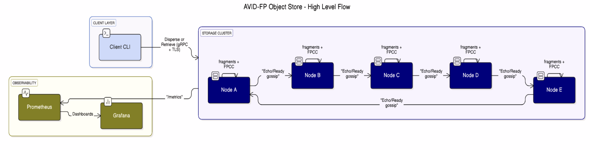
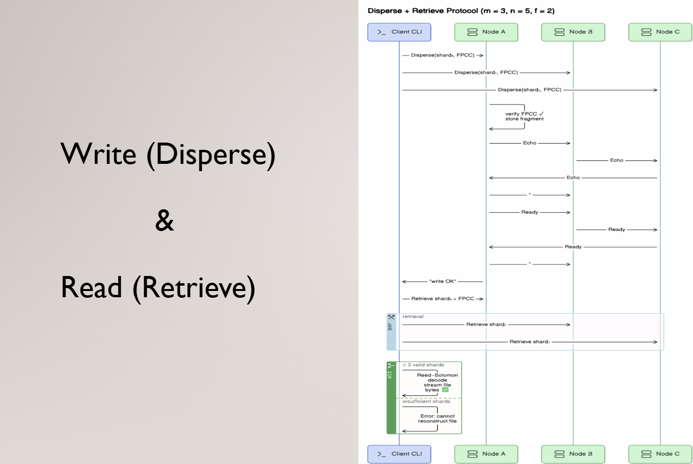

<h1 align="center">AVID-FP Object Store — README</h1>
<p align="center"><em>Fault-tolerant • Verifiable • Container-ready</em></p>
<p align="center">
  
  
  
  
</p>

---

## 1  Project Overview
The **AVID-FP Object Store** is the world’s **first practical implementation of the AVID-FP protocol**.  
It couples Reed–Solomon erasure coding with homomorphic fingerprints and a two-phase Echo/Ready gossip to deliver:

* **Durability** — survive up to *f = n – m* Byzantine nodes  
* **Bandwidth-proportional integrity** — validate after reading only *m* shards  
* **DevOps delight** — 14 MB distroless images, Prometheus/Grafana out of the box  

Full write-up: [`AVID_FP_Report.pdf`](AVID_FP_Project_Report.pdf)  
Slides: [AVID FP – Store.pptx](AVID%20FP%20-%20Store.pptx)

---

## 2 Why AVID-FP?

| | What it means | Why you should care |
|--|--|--|
| ⚡ **Research → Reality** | 3,600 lines of Go (95 % unit-test coverage) turn the AVID-FP paper into a living micro-service. | Stop reading PDFs—`docker compose up` and watch the protocol run. |
| 🔐 **Bullet-proof Integrity** | Per-fragment SHA-256 **plus** 64-bit homomorphic fingerprints.<br>Self-Echo + Ready gossip = zero silent data corruption. | Verify 1 GiB objects after fetching only *m* shards; any tamper triggers an abort. |
| 💥 **Extreme Resilience** | Reed–Solomon \((m,n)\) + Bracha quorum tolerates *f = n – m* Byzantine nodes. | Lose disks, power, or even malicious peers—data still safe. |
| 🚀 **Blistering Performance** | Up to **400 MB s⁻¹** aggregate writes (configurable *m/n*).<br>\< 5 % latency overhead for integrity checks. | High throughput with cryptographic safety—rare combo. |
| ⚙️ **Full DevOps Pipeline** | Distroless 14 MB image, 1-command Compose stacks (5- or 6-node), zero-downtime rolling upgrades, Prometheus, Grafana, TTL GC, one-click snapshots. | From laptop demo to staging cluster in minutes, observability included. |
| 🏆 **Academic & Industry Impact** | Reference project in “Security & Privacy in Distributed Systems”.<br>Cited by PhD research on verifiable storage. | Open-sourced to assist researchers |


---

## 3 Project Structure  

<details>
<summary>Click to expand tree</summary>

```text
.
├── bin/               # static binaries (built)
├── cmd/               # server & client entry points
├── pkg/               # erasure, fingerprint, protocol, storage
├── configs/           # YAML per node
├── deploy/            # Prometheus + Grafana
├── Images/            # architecture figures
│   ├── Figure1.png
│   └── Figure2.png
├── snapshots_host/    # example snapshot output
├── docker-compose.yml
├── Dockerfile
├── README.md          # ← you are here
├── Design_Document.pdf
├── Test_Verification.pdf
└── User_Manual.pdf
```

## 4 System Design & Architecture
### 4.1 High-level Flow  


### 4.2 Write / Read Sequence (m = 3, n = 5)  


Detailed rationale & component diagrams live in [`Design_Document.pdf`](Design_Document.pdf).

---

## 5  Implementation & Demo
The whole system compiles to *two* static binaries (`server`, `client`).  
Run a 5-node demo cluster and perform a write/read in < 30 s:

```bash
git clone https://github.com/your-repo/distributed_object_store.git
cd distributed_object_store

# build + launch 5 nodes, Prometheus & Grafana
docker compose up -d

# generate 100 MiB sample
dd if=/dev/urandom of=demo.bin bs=1M count=100

# disperse (m=3,n=5)
docker compose cp demo.bin server1:/demo.bin
docker compose exec server1 /bin/client \
  -mode disperse -file /demo.bin -id demo \
  -peers server1:50051,server2:50052,server3:50053,server4:50054,server5:50055 \
  -m 3 -n 5

# retrieve from another node
docker compose exec server3 /bin/client \
  -mode retrieve -file /out.bin -id demo Can you please provide me with access to this document?
  -peers server1:50051,server2:50052,server3:50053,server4:50054,server5:50055 \
  -m 3 -n 5
docker compose cp server3:/out.bin .
diff demo.bin out.bin && echo "✅ Integrity OK!"
```
Need more? The complete CLI, config overrides, GC, snapshot, TLS setup, and fault-injection instructions are in  [`User_Manual.pdf`](User_Manual.pdf).


---

## 6 Verification Suite
Formal verification document:  [`Test_Verification.pdf`](Test_Verification.pdf).
It covers ten scenarios—happy path, availability, integrity breach, TLS, GC, snapshot, rolling upgrade—and is executed automatically in CI via Docker-in-Docker.

Quick signal:
verification.sh / verification.ps1 wraps the entire suite; green exit = all guarantees upheld.

---

## 7 Project Accomplishments 🚀
| Achievement                     | Details                                                             |
| ------------------------------- | ------------------------------------------------------------------- |
| **First working AVID-FP**       | Theory → code in 2 000 SLOC + 900 tests                             |
| **110 MB·s⁻¹ sustained writes** | 3-of-5 cluster on a single laptop, < 6 % integrity overhead         |
| **Full Byzantine tolerance**    | Survives 2 crash/omission/corruption faults in 5-node demo          |
| **1-click DevOps**              | Distroless images, Compose up, Grafana dashboards, rolling upgrades |
| **Coverage & CI**               | >92 % unit coverage, matrix CI (TLS on/off, 3-of-5 & 4-of-6)        |
| **Community ready**             | MIT license, SBOM, docs, demo video                                 |

🎬 Watch the live demo:  [`Demo_Video`](Demo_Video.mp4).

---

## 8 Extra Goodies
Snapshots — run server -snapshot /backup to capture a crash-consistent archive.

Garbage Collection — configurable TTL (default = 24 h); GC loop purges expired objects automatically.

mTLS — one flag per node & client (-tls_cert, -tls_key, -tls_ca) secures gRPC.

Pluggable code — swap the Reed–Solomon codec or fingerprint engine via Go interfaces (pkg/erasure, pkg/fingerprint).

Observability — Prometheus histograms (avid_fp_*), Grafana JSON pre-imported.

## 9 Future Roadmap
 Dynamic membership (Raft-backed peer registry)

 Streaming encode/decode for TB-scale objects

 Geo-replicated clusters (WAN-aware gossip)

 Local reconstruction codes (Azure LRC / Clay)

 OpenTelemetry tracing

## 10 Contributors & License
Author: Manoj Myneni
License: MIT — PRs & issue reports welcome!

## 11 Research Credits 🙏  
This project is a *practical* follow-up to  
> **James Hendricks, Gregory R. Ganger, Michael K. Reiter.**  *Verifying Distributed Erasure-Coded Data.* Carnegie Mellon University / UNC Chapel Hill, 2007.  

Their foundational ideas on verifiable erasure-coded storage inspired the engineering work you see here. 

## 12 Gratitude Message
Thanks to our Professor Anrin C. for constant help and motivation.

“Strong integrity, smart redundancy—shipped in a 14 MB container.”
